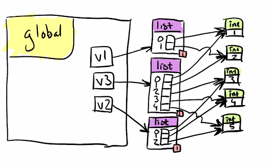
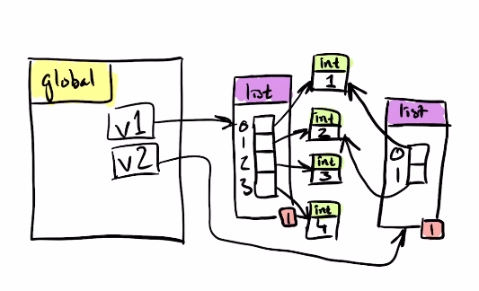

# Låd- och Pildiagram

Syftet med ett låd- och pildiagram är att förstå kopplingen mellan variablers
namn, typer och värden i datorns minne. Mer specifikt handlar det om de variabler som du skapar själv under programmets gång och deras resa genom funktioner och
metoder som du har skrivit själv.

## Varför låd- och pildiagram?

Kurens främsta syfte med låd- och pildiagram är till för att se till att programmet gör rätt. Programmerare som missförstår variabler och referenser kan tappa information eller förändra fel objekt vilket leder till att programmet gör rätt. Eftersom det är en grundkurs så lägger den också grunden för att förstå mer avancerade koncept som hur man programmerar högpresterande program.

## Diagrammets tre delar

Vi delar in diagrammet i 3 delar: Den globala lådan ligger nere till vänster i diagrammet, stacken ligger ovanför den globala lådan, men också till vänster och den tredje delen: heapen ligger till höger. Heapen är lagringsplatsen för Pythons objekt.


## Instruktionerna som delas ut på kontrollskrivningen liknar dessa:
På var och en av nedanstående uppgifter behöver du rita en bild över minnet vid en viss
position under programmets körning. Du behöver ha med:
1. En låda för globala variablerna längst ner till vänster i diagrammet.
2. En stackpost (Engelska: stack frame) per aktivt funktions-/metodanrop staplade i en
stack. I stackpostens övre vänstra hörn ska det stå vilken funktion som har anropats
följt av ett kolon och raden som funktionsanropet skedde på. Stacken växer uppåt så det
senaste oavslutade funktions- eller metodanropet ska stå överst. Om det är en metod som
har anropats, kom ihåg parametern self som ska peka ut objektet som metoden opererar
på. Observera att stacken innehåller en stackpost per anrop och inte en stackpost per
funktion. Skillanden märks särskilt vid rekursiva anrop.
3. Ta bort stackposter från avslutade funktions-/metodanrop och uppdatera referensräknin-
gen för eventuella objekt som pekats ut av deras lokala variabler och parametrar.
4. Se till att pilarna har spetsar och inte bara är streck. Pilarna utgår från variabler,
attribut, parametrar, listindex eller dictionary-nycklar och spetsen pekar alltid på ett objekt på
heapen. Om pilarnas linjer behöver korsa varandra, gör en broliknande böj. Det blir
lättare att felsöka och rätta diagrammen med så få korsande linjer som möjligt.
5. Den tredje typen av låda i ett låd- och pildiagram förutom stackposter och den globala
lådan är objekten på heapen. Överst i dessa lådor skriver vi objektets typ med en
heldragen linje under. Om objektet endast har ett värde så skrivs detta värde under
strecket i objektet. Om objektet däremot har attribut eller nycklar så ritas dessa som
små lådor med namnet inuti lådan och pilar som utgår från dessa lådor visar bindningen
till ett annat objekt. Om objektet har listindex så skrivs indexen bredvid de små lådorna.
6. För vissa objekt mäter vi referensräkning. Exempel inkluderar men är inte begränsade
till: listor, objekt av klasser som definierats i koden samt heltal större än 256 eller mindre
än -5. Vi mäter inte referensräkning på heltal n där −5 ≤ n ≤ 256 samt objekten None,
True och False. Referensräkningen mäter antalet pilar som pekar ut objektet. För att
vara mer noggrann så räknas endast de pilar som har sin utgångspunkt från den globala
lådan, stackposter för funktioner/metoder som inte har returnerat ännu och objekt som
har referensräkning större än 0. Referensräkningen skriver vi i en liten låda längst ner
till höger på relevanta objekt.
7. Ta med alla referensräknade objekt som har varit bundna till variabler, parametrar, attribut, nycklar eller listindex under programmets körning. Om det är möjligt att skräpsamlaren (the garbage
colllector) har tagit bort ett objekt, låt det stå kvar men rita en pil från skräpsamlaren
till objektet som ska tas bort och uppdatera referensräkningen för övriga objekt som
pekas ut av pilar från objekt med referensräkning 0.


## Den globala lådan.

Nere till vänster i digrammet ligger den globala lådan. Den ritas som en fyrkantig låda där det uppe till vänster står "global" utan citattecken.
Konstanter hör hemma i den globala lådan. Programmet blir onödigt
svårläst om varje funktion behövde ta in konstanter som parametrar. Därför existerar en global låda.
Det är den första vi ritar och den innehåller alla namn som är tillgängliga överallt i programmet. Om du skapar en variabel utanför funktioner och klasser så hamnar den här.
Tyvärr är den överanvänd, särskilt i grundkurser. Om alla variabler i ett program är globala så blir programmet mindre överblickbart och svårare att dela upp i små, automatiskt testbara delar. Det är därför projektet har som krav att inte ha några globala variabler.

### Globalt men inte i diagrammet
I minnet finns några saker som vi inte har med i låd- och pildiagrammet:

* När du startar ett Pythonprogram så finns redan ett antal variabler i minnet. Exempelvis är konstanten ```__name__``` satt till ```'__main__'``` om programmet körs
som ett script.
* Pythons inbyggda funktioner som abs eller print ligger globalt.
* Funktioner som du definierar i koden ligger globalt.
* Klasser som int, float och list har ett objekt som representerar själva klassen och alla objekt av denna typ pekar på det.

Det är fel att rita ut dessa i era låd- och pildiagram eftersom de
begraver den fakta vi faktiskt söker: förhållandet mellan de namn som ditt
program skapat och dess värden. Ovanstående fakta abstraheras bort. Om du ritar med något av ovanstående så kommer diagrammet att vara på fel abstraktionsnivå.


## Stacken

Stacken ritas uppe till vänster i låd- och pildiagram. Den ansvarar för vart programmet återvänder när en funktion eller metod returnerar, samt för att hålla reda på vilka parametrar och lokala variabler som är aktiva. Stacken växer uppåt och den senaste stackposten ligger överst. Stackposten innehåller namnet på funktionen/metoden som anropats, raden som anropet skedde på samt parametrar och lokala variabler. Om det är en metod som anropats så behöver vi också ha med parametern self som pekar ut objektet som metoden opererar på.


### Det lokala scopet - en stackframe

Varje gång en funktion anropas så skapas en ny låda som kallas
en stackframe. Stackframen är scope för alla parameternamn och lokala variabelnamn. För att skilja dessa lokala scope åt så märker man dem med funktionsanropets plats i koden. Det lokala scopet innehåller parameternamn och namn på lokala variabler som är bundna till värden i datorns minne.

Observera att det är en stackframe per anrop och inte per funktion. Särskilt i rekursiva funktioner (funktioner som anropar sig själva) så innebär det att stacken kan innebära att samma funktion finns på flera ställen i stacken samtidigt. Detta är helt normalt och det är därför vi skriver ut raden som anropet skedde på i stackposten.

Om det utförs ett funktionsanrop inifrån ett funktionsanrop så staplas alla
stackframes ovanpå varandra i en stack (ordet stack används nu i sin engelska
betydelse som är "stapel".) Stacken ritas vanligtvis uppe till vänster
i diagrammet. Lämna lite utrymme mellan den globala lådan (som ligger
  nere till vänter) och Stacken. Ordningen som anropen skett i utläses
  genom att följa stapeln av stackframes uppåt vid nya anrop och nedåt
  då funktionsanropen avslutas.

När en funktion returnerar (uttryckligen genom return eller genom att ha
kört all kod som ingår i funktionen) så tas anropets stackframe bort
från diagrammet. (Överkurs: Ofta lever den kvar i minnet som en Zombieframe, men det är inget som vi visar i diagrammet.)
Fråga: Om vi tar bort den efter anropet, kan vi då skippa att rita ut
den om raden med kommentar nås efter att anropet har slutförts?
Svar: Tekniskt sett ja, men tänk på att det kan ha skapats objekt i minnet som lever kvar eller ska skräpsamlas och dessa behöver vara med
i diagrammet.

Exempelkod:
Rita låd- och pildiagram när körningen når den sista printsatsen i varje funktion. Rita också ett diagram då vi har lämnat main på slutet.
```python
def f(v, i):
    v.append(1)
    i += 2
    print("f", locals())


def g(v, i):
    v.append(2)
    i += 3
    f(v, i)
    print("g",locals())


def main():
    v = []
    i = 0
    g(v, i)
    print("main", locals())


if __name__ == '__main__':
    main()
```
[Facit](stackfacit.md)

Om du anropar en metod på en klass så läggs metodanropet på stacken, precis som med funktioner. Self pekar på objektet vars metod har anropats. Exempelkod följer. Rita ett diagram då programmet når den kommenterade raden.
```python
class A:
    def __init__(self):
        self.count = 0

    def inc(self):
        self.count += 1
        # Diagram här innan vi återvänder


def main():
    a = A()
    a.inc()


if __name__ == '__main__':
    main()
```
[Facit](objektfacit.md)

Exempelfråga:
Rita ett låd- och pildiagram då koden nedan når den kommenterade raden:
```python
left = 1000
right = 2000
middle = left
# Den kommenterade raden
right = left
left = middle
```
[Facit](middlefacit.md)

Kuggfråga:
Rita låd- och pildiagram då programmet når den kommenterade raden.

```python
def f(n):
    v = []
    v.append(n)


# Den kommenterade raden
```
[Facit](kuggfraga.md)

Rita ett låd- och pildiagram då programmet når den kommenterade raden _för andra gången_:
```python
def f(n):
    v = []
    v.append(n)
    # Den kommenterade raden
    return


f(1)
f(2)
```
[Facit](andragangen.md)

### Stacken överkurs

I fortsättningskursen och i P-uppgifter för betyg A kommer ni att möta program med flera trådar. Varje tråd har då en egen stack och variabler från olika trådar kan vara bundna till samma objekt på heapen. Om dessa objekt är förändringsbara (som datatypen list) så behöver förändringarna synkroniseras. Ett annat alternativ är att man ser till att alla delade variabler är oföränderliga (som datatypen tuple). Båda lösningarna har olika för och nackdelar ur prestanda- och begriplighetssynpunkt. På kontrollskrivningen i grundkursen kan ni dock lita på att det bara blir en stack per diagram.

## Datatyper

Datatyper används för att beskriva vilken typ av data som lagras och hur objekt av denna
typ kan skapas, läsas, förändras och kombineras med andra objekt av denna typ eller eventuellt andra typer. Datatypen anges i låd- och pildiagram genom att
typens namn skrivs överst på varje utpekat objekt. Typen utelämnas alltid på
variabelnamn, stackframes och på lådan med det globala scopet.

### Datatypen list

Datatypen list är oftast den första muterbara datatypen som ni möter i kursen. Muterbara datatyper innebär att själva objektet kan förändras oberoende av vad som pekar på den. Förändringsbarhet är bra i vissa lägen, till exempel när vi har en lista med nästan en miljon element och vill lägga till ett extra. Då vore det besvärligt att behöva skapa en ny enorm lista. Tyvärr ger det också upphov till några andra, mer förvirrande situationer som vi täcker nedan.

När vi adderar två listor med varandra så skapas en ny lista. Den nya listan pekar ut samma objekt som de gamla listorna pekade ut. Den nya listan (v3 i exemplet nedan) är alltså en grund kopia.
```Python
>>> v1 = [1, 2]
>>> v2 = [3, 4, 5]
>>> v3 = v1 + v2
>>> v1, v2, v3
([1, 2], [3, 4, 5], [1, 2, 3, 4, 5])
>>>
```



När vi slice:ar en lista
```Python
>>> v1 = [1, 2, 3, 4]
>>> v2 = v1[:2]
>>> v1, v2
([1, 2, 3, 4], [1, 2])
>>>
```
så skapas en grund kopia av (delar av) listan. Den nya listan v2 pekar på samma objekt som den gamla listan. Detta gäller även när hela listan kopieras.



```Python
>>> v1 = [1, 2]
>>> v2 = v1[:]
>>> v1, v2
([1, 2], [1, 2])
>>> v2[1] = 3
>>> v1, v2
([1, 2], [1, 3])
>>>
```

Fler exempel finns på [Pythons hemsida](https://docs.python.org/3/tutorial/datastructures.html).

## Aliasing

Aliasing definieras som att ett objekt kan nås på flera olika sätt. Exempevis genom olika variabelnamn, parameternamn, index, attribut, nycklar. Om objektet är oföränderligt (immutable) så är detta endast en optimering som sparar minne, men om objektet är föränderligt (mutable) så kan detta leda till mer svårbegripliga beteenden som att ett objekt förändrats via ett helt annat namn, eventuellt inne i en helt annan funktion.

Exempel där detta används internt av Python syns här:
```python
>>> import random
>>> v = [1, 2, 3, 4, 5]
>>> random.shuffle(v)
>>> v
[3, 5, 2, 1, 4]
>>>
```
I detta exempel skickades listan som v är bunden till med till random.shuffle
som kastade om värdena direkt i listan (in place).

Ett exempel på motsatsen är pythons inbyggda funktion sorted som returnerar
en grund kopia av en sorterad lista:
```python
>>> v = [1000, 4000, 2000, 3000, 5000, 7000, 6000]
>>> fixed = sorted(v)
>>> fixed
[1000, 2000, 3000, 4000, 5000, 6000, 7000]
>>> v
[1000, 4000, 2000, 3000, 5000, 7000, 6000]
>>>
```

Särskilt klurigt blir det när egna funktionsanrop använder ett helt annat parameternamn men ändå förändrar listan:
```python
import random


def f(victims):
    while victims:
        target = random.choice(victims)
        victims.remove(target)
        print(target)


v = "1000 2000 3000 4000 5000".split()
print("before", v)
f(v)
print("after", v)
```
Om vi kör detta kodexempel så är ett möjligt resultat:
```python
$ python3 aliasing.py
before ['1000', '2000', '3000', '4000', '5000']
1000
4000
2000
3000
5000
after []
$
```

### Tentatal från 2018

Vad skriver följande Python3-program ut?
```python
def mystery(v, n):
    n = n + 1
    v[1] = n


def main():
    v = [1, 2]
    n = 4
    mystery(v, n)
    print(v, n)


main()
```
Tillägg från tentan: Rita ett låd- och pildiagram för hur det ser ut innan mystery returnerar.
[Facit](tentatal2018.md)

Ett annat namn för aliasing är sharing.


### Aliasing, vanliga missförstånd

Aliasing brukar oftast förenklas till att säga att ordet kommer från alias, dvs annat namn men det är en förenkling. Att två variabler pekar på samma objekt är ett exempel på aliasing men inte en definition. Det finns flera andra sätt att skapa aliasing som inte involverar variabler. Exempelvis kan vi skapa aliasing genom att använda index på en lista eller nycklar på en dictionary. Vi kan också skapa aliasing genom att använda attribut på ett objekt. Detta är viktigt att förstå eftersom det är en vanlig missuppfattning att aliasing endast handlar om variabler.

## Referensräkning

Varje objekt i Python har en referensräkning som anger hur många andra lådor
i diagrammet som pekar på det. Referensräkningen används för att avgöra
när ett objekt inte behövs i minnet längre. Vi gör referensräkning genom att skriva ett tal nere i högra hörnet på varje objekt som ligger utanför stacken.

### Exempel på tentatal
Rita en minnesbild med låd- och pildiagram för programmet nedan då det når denkommenterade raden.
```python
left = 1000
right = left
# Den kommenterade raden
```

Inspirerat av ett tentatal: Rita låd- och pil-diagram för hur det kan se ut i minnet då programmet når sista raden i main-funktionen.
```python
class Node:
    def __init__(self, value, following):
        self.value = value
        self.following = following


def print_values(first):
    temp = first
    while temp:
        print(temp.value)
        temp = temp.following


def create_list(size):
    first = Node(size, None)
    for i in range(size-1, 0, -1):
        first = Node(i, first)
    return first


def destroy_element(first, index):
    """returns the first element where index has been destroyed"""
    if index == 0:
        return first.following
    answer = first #we will change this variable
    for i in range(index-1):
        first = first.following
    following_following = first.following.following
    first.following = following_following
    return answer


def main():
    first = create_list(4)
    print_values(first)
    first = destroy_element(first, 2)
    print_values(first)


if __name__ == '__main__':
    main()
```

[Facit](facit.md)


# Pythons vanligaste datatyper:
För att rita ett korrekt diagram behöver vi hålla koll på de vanligaste
datatyperna i Python. Dessa delas in i oföränderliga (immutable) och
föränderliga (mutable). Att en datatyp kan förändras betyder dock
inte att den alltid gör det, vilket innebär att om vi vill göra rätt
i diagrammet så behöver vi veta mer om typen än hur den är klassificerad.
## Oföränderliga datatyper (immutable data types)
Alla datatyper som kan skapas från en literal i Python är immutable, till exempel: int, float, complex, str, NoneType och bool. Detta innebär att det inte går att ändra ett sådant objekt. Om du gör en operation som + på en int eller en sträng så kommer det antingen att skapas ett nytt objekt (som när du adderar två långa strängar) eller pekas ut ett objekt som redan låg i minnet (som när du adderar två int:ar och får ett tal mellan -5 och +256).
## Återanvändbara objekt
Det finns bara ett objekt av datatypen NoneType, nämligen None. Datatypen bool har två objekt, True och False. Alla int:s mellan -5 och +256 återanvänds. Alla variabler med värdet None pekar på samma värde och
därför kan de jämföras med ```is``` istället för ```==```.
## Förändringsbara datatyper (mutable data types)
Datatypen list och de flesta klasser som definieras i kodexempel i kursen
är förändringsbara. Det innebär att det utpekade objektet kan förändras
under programmets körning, men det garanterar inte att det gör det. Om du lägger ihop två listobjekt med ```v3 = v1 + v2``` så skapas ett nytt listobjekt. Om du däremot gör ```v.append(17)``` på en lista så förändras en befintlig lista. Det första är mer begripligt eftersom v1 och v2 behåller sina värden efter operationen. Det sista har bättre prestanda eftersom vi inte behöver kopiera hela listobjektet för att
lägga till ett värde i slutet (Överkurs: I vissa lägen kommer append att bli långsamt eftersom det reserverade utrymmet i listan kan ta slut. Då kopieras hela listan (men inte resten av objektet) över till en ny lista som är dubbelt så stor, men detta sker exponentiellt sällan).
# Sammanfattning
Låd- och pildiagram täcker förhållandet mellan namn, datatyper och värden. De illustrerar koncept som scope, aliasing, garbage collection
och mutability.


1. Fler exempel finns i [exempeltentan](https://github.com/dicander/training_exam).
2. Den [första tentan på det nya formatet](https://gits-15.sys.kth.se/dicander/gruprog_tenta_2019-10-18)
har ännu fler exempel.
3. [Fx-kompletteringen](https://gits-15.sys.kth.se/dicander/Fxkomplettering20191202) har fler exempel.
4. [Omtentan](https://gits-15.sys.kth.se/dicander/gruprogtenta2019-12-17) med facit.
5. Theo Ingelstam har förberett [övningar med facit här](https://github.com/Theo-Ing/public-work/tree/master/BoxAndArrowDiagrams).
