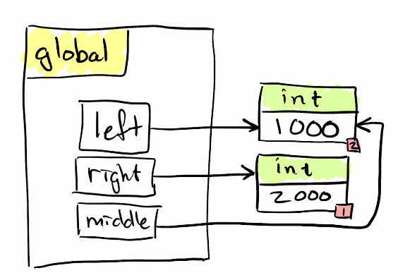

Vanliga fel i detta läge: Många tror felaktigt att middle har skapat en kopia, men när tilldelningssatsen ser ett ensamt namn så återanvänds objektet som det
pekar ut oavsett om det är förändringsbart eller inte (i detta fall är det immutable).

Förändringar som inträffar efter kommentaren syns inte i diagrammet. Betrakta kommentaren som en synkpunkt där vi har kört allt innan och inget efter.
