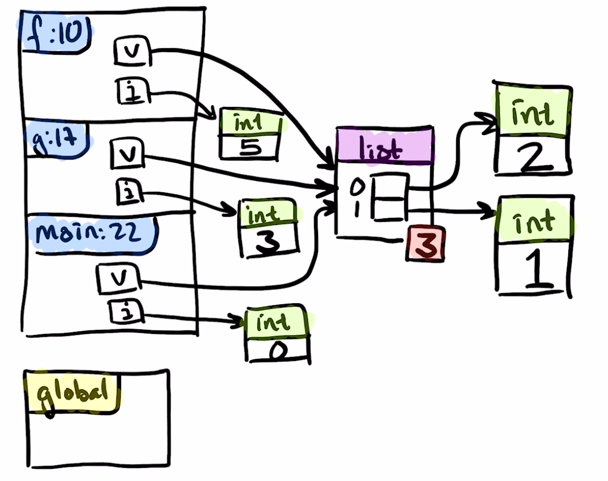
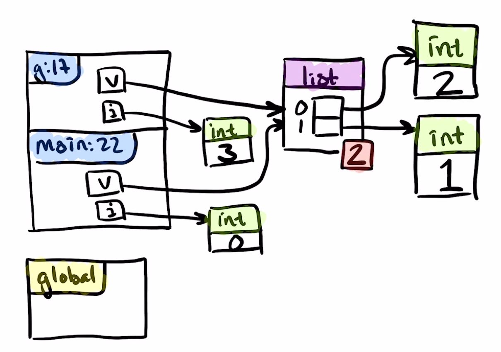
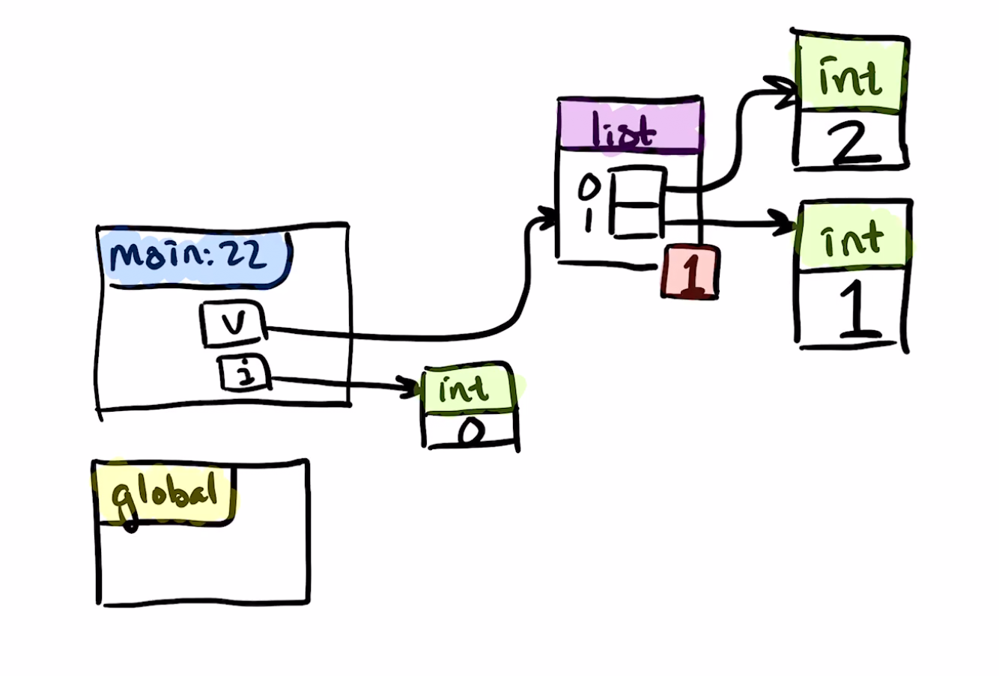
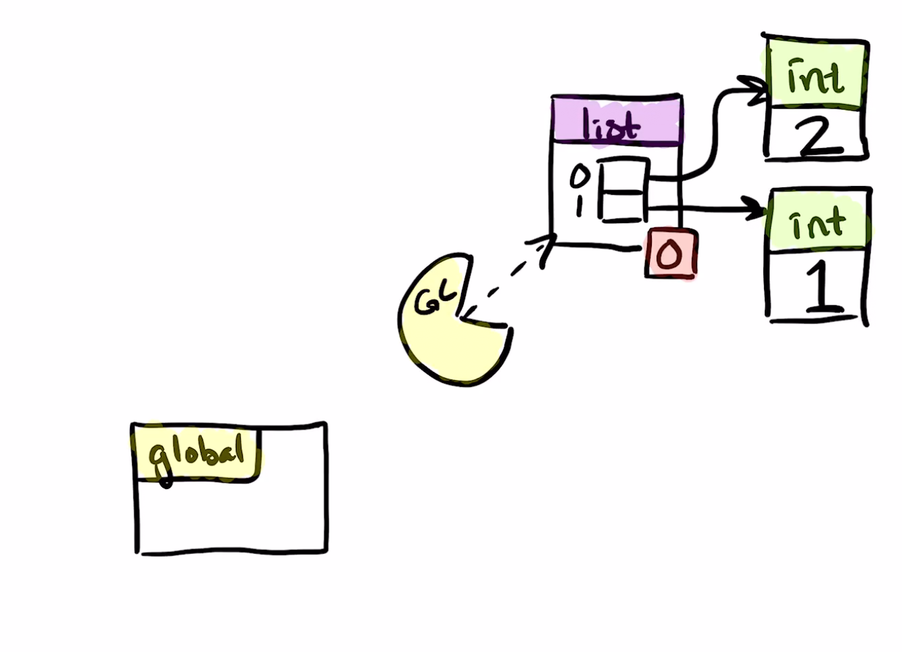

# Facit

Observera att på tentan så kommer du inte skriva några förklaringar utan diagrammet räcker.

Studera denna del av koden.
```python
def f(v, i):
    v.append(1)
    i += 2
    print("f", locals())
```
Funktionen f anropades med argumenten v och i. Vid anropet var v kopplat till en lista som pekade ut en int med värdet 2 och i pekade ut en int med värdet 3.

Inuti f förändrades listobjektet med hjälp av metoden append som lade till en plats i listan och pekade den på en int med värdet 1. Raden:
```python
    i += 2
```
pekar om parametern i till att peka på 5. Observera att intar aldrig förändras i Python, så det gamla värdet 3 som pekades ut av ett annat i från anropet till g ligger kvar och förblir utpekat av detta andra i.




Studera nu denna del av koden:
```python
def g(v, i):
    v.append(2)
    i += 3
    f(v, i)
    print("g",locals())
```
När vi återvänder från anropet till f så finns det bara två variabelnamn som pekar ut listan. 5:an är en liten int och den finns tekniskt kvar i minnet, men vi bryr oss inte om att räkna referenser på intar mellan -5 och +256. Det i som förändrades inuti i var inte i:et i g utan en lokal variabel med samma namn, så i förblir 3 inuti den här funktionen. Förändringen av listan är annorlunda eftersom den gjordes med append och append förändrar objektet istället för att skapa ett nytt.



Studera nu main
```python
def main():
    v = []
    i = 0
    g(v, i)
    print("main", locals())
```
v skapades tom i denna funktion, men har under programmets lopp förändrats med hjälp av append. Eftersom alla v i programmet har pekat ut samma objekt och inte en kopia av det och alla förändringar har skett med hjälp av append på samma listobjekt så pekar v på en förändrad lista.

I har en annan historia. Varje gång som i har förändrats så har det varit ett annat i och det har inte förändrat det värde som pekades ut av i inuti main. Additionsoperatorn i Python3 förändrar nästan aldrig objekten utan pekar istället ut andra, eventuellt nyskapade objekt. (I detta program har den endast pekat ut de int:ar som alltid finns i minnet.)



När vi slutligen lämnar main så finns det ingenting kvar som pekar på listan. Dess referensräkning når 0 och skräpsamlaren (the garbage collector) kommer och tar den.


